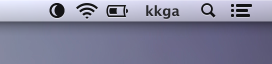

### Replacement menu bar icon for f.lux (http://justgetflux.com)

Because I hate the default one.

***

#### How to replace

1. `ctrl+click` on Flux.app in your Applications folder and choose `Show Package Contents`
2. Navigate to `Contents > Resources`
3. Replace `flux-icon-*.tiff` files with the new ones